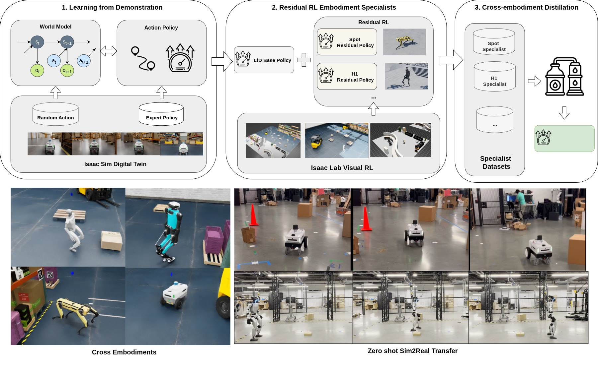

<h1 align="center"> COMPASS: Cross-Embodiment Mobility Policy via Residual RL and Skill Synthesis </h1>

<div align="center">

[](https://isaac-sim.github.io/IsaacLab/v2.1.0/index.html)
[](https://docs.isaacsim.omniverse.nvidia.com/4.5.0/index.html)
[](https://ubuntu.com/blog/tag/22-04-lts)
[](https://opensource.org/licenses/Apache-2.0)


[[Website]](https://nvlabs.github.io/COMPASS/)
[[arXiv]](https://arxiv.org/abs/2502.16372)
</div>

## Overview

This repository provides the official PyTorch implementation of [COMPASS](https://nvlabs.github.io/COMPASS/).

<p align="center">
    
</p>


COMPASS is a novel framework for cross-embodiment mobility that combines:
- Imitation Learning (IL) for strong baseline performance
- Residual Reinforcement Learning (RL) for embodiment-specific adaptation
- Policy distillation to create a unified, generalist policy

## Quick Start

🚀 **Get started in 3 steps:**
1. [Install Isaac Lab and dependencies](#installation)
2. [Train your own specialists or deploy on robots](#usage)
3. [Data generation for GROOT post-training](#groot-post-training-with-compass-distillation-datasets)

## Installation

<details>
<summary><strong>📦 Complete Installation Guide</strong> (click to expand)</summary>

### 1. Isaac Lab Installation
* Install Isaac Lab and the residual RL mobility extension by following this [instruction](compass/rl_env/README.md).

### 2. Environment Setup
* Create and activate a virtual environment:
  ```bash
  python3 -m venv venv
  source venv/bin/activate
  ```

### 3. Dependencies
* Install the required packages:
  ```bash
  ${ISAACLAB_PATH}/isaaclab.sh -p -m pip install -r requirements.txt
  ```

### 4. X-Mobility Installation
* Install the [X-Mobility](https://github.com/NVlabs/X-MOBILITY) package:
  ```bash
  ${ISAACLAB_PATH}/isaaclab.sh -p -m pip install x_mobility/x_mobility-0.1.0-py3-none-any.whl
  ```
* Download the pre-trained X-Mobility checkpoint from: https://huggingface.co/nvidia/X-Mobility/blob/main/x_mobility-nav2-semantic_action_path.ckpt

### 5. Residual RL environment USDs
* Download the residual RL environment USDs from: https://huggingface.co/nvidia/COMPASS/blob/main/compass_usds.zip
* Unzip and place the downloaded USDs in the `compass/rl_env/exts/mobility_es/mobility_es/usd` directory

</details>


## Usage

<details>
<summary><strong>🤖 Training Residual RL Specialists</strong> (click to expand)</summary>

### Residual RL Specialists

* Train with the default configurations in `configs/train_config.gin`:
  ```bash
  ${ISAACLAB_PATH}/isaaclab.sh -p run.py \
      -c configs/train_config.gin \
      -o <output_dir> \
      -b <path/to/x_mobility_ckpt> \
      --enable_camera
  ```

* Evaluate trained model:
  ```bash
  ${ISAACLAB_PATH}/isaaclab.sh -p run.py \
      -c configs/eval_config.gin \
      -o <output_dir> \
      -b <path/to/x_mobility_ckpt> \
      -p <path/to/residual_policy_ckpt> \
      --enable_camera \
      --video \
      --video_interval <video_interval>
  ```

> **NOTE**: The GPU memory usage is proportional to the number of environments in residual RL training. For example, 32 environments will use around 30GB memory, so reduce the number of environments if you have limited GPU memory.

</details>

<details>
<summary><strong>🧠 Policy Distillation</strong> (click to expand)</summary>

### Policy Distillation

* Collect specialist data:
  * Update specialists policy checkpoint paths in [dataset_config_template](configs/distillation_dataset_config_template.yaml)
  * Run data collection:
    ```bash
    ${ISAACLAB_PATH}/isaaclab.sh -p record.py \
        -c configs/distillation_dataset_config_template.yaml \
        -o <output_dir> \
        -b <path/to/x_mobility_ckpt> \
        --dataset-name <dataset_name>
    ```

* Train generalist policy:
  ```bash
  python3 distillation_train.py \
      --config-files configs/distillation_config.gin \
      --dataset-path <path/to/specialists_dataset> \
      --output-dir <output_dir>
  ```

* Evaluate generalist policy:
  ```bash
  ${ISAACLAB_PATH}/isaaclab.sh -p run.py \
      -c configs/eval_config.gin \
      -o <output_dir> \
      -b <path/to/x_mobility_ckpt> \
      -d <path/to/generalist_policy_ckpt> \
      --enable_camera \
      --video \
      --video_interval <video_interval>
  ```

</details>

<details>
<summary><strong>📤 Model Export</strong> (click to expand)</summary>

### Model Export

* Export RL specialist policy to ONNX or JIT formats:
  ```bash
  python3 onnx_conversion.py \
      -b <path/to/x_mobility_ckpt> \
      -r <path/to/residual_policy_ckpt> \
      -o <path/to/output_onnx_file> \
      -j <path/to/output_jit_file>
  ```

* Export generalist policy to ONNX or JIT formats:
  ```bash
  python3 onnx_conversion.py \
      -b <path/to/x_mobility_ckpt> \
      -g <path/to/generalist_policy_ckpt> \
      -e <embodiment_type> \
      -o <path/to/output_onnx_file> \
      -j <path/to/output_jit_file>
  ```

* Convert the ONNX to TensorRT:
  ```bash
  python3 trt_conversion.py -o <path/to/onnx_file> -t <path/to/trt_engine_file>
  ```

</details>

<details>
<summary><strong>🔧 Add New Embodiment or Scene</strong> (click to expand)</summary>

### Add New Embodiment or Scene

* Follow this [instruction](compass/rl_env/README.md) to add a new embodiment or scene to the Isaac Lab RL environment.
* Register the new embodiment or scene to the `EmbodimentEnvCfgMap` and `EnvSceneAssetCfgMap` in [run.py](run.py), then update the configs or use command line arguments to select the new embodiment or scene.

</details>

<details>
<summary><strong>🚀 ROS2 Deployment</strong> (click to expand)</summary>

### ROS2 Deployment

To deploy COMPASS in Isaac Sim or on real robots using ROS2, please follow the detailed instructions in [ros2_deployment/README.md](ros2_deployment/README.md). This guide covers containerized workflows, and Isaac Sim integration.

</details>


<details>
<summary><strong>📊 Logging Options</strong> (click to expand)</summary>

### Logging

The training and evaluation scripts use TensorBoard for logging by default. Weights & Biases (W&B) logging is also supported for more advanced experiment tracking features.

**To use TensorBoard (default):**
- Logs will be saved to `<output_dir>/tensorboard/`
- View logs with: `tensorboard --logdir=<output_dir>/tensorboard/`

**To use Weights & Biases:**
1. Install and set up W&B: `pip install wandb` and follow the [setup instructions](https://docs.wandb.ai/quickstart)
2. Log in to your W&B account: `wandb login`
3. Add the `--logger wandb` flag to your command:
   ```bash
   ${ISAACLAB_PATH}/isaaclab.sh -p run.py \
       -c configs/train_config.gin \
       -o <output_dir\
       -b <path/to/x_mobility_ckpt> \
       --enable_camera \
       --logger wandb \
       --wandb-run-name "experiment_name" \
       --wandb-project-name "project_name" \
       --wandb-entity-name "your_username_or_team"
   ```

</details>


## GROOT Post-training with COMPASS Datasets

The COMPASS distillation datasets can also be used to train VLA models like [GROOT](https://github.com/NVIDIA/Isaac-GR00T), to enhance their navigation capabilities.

<details>
<summary><strong>🤖 GROOT Post-training Steps</strong> (click to expand)</summary>

**Step 1: Convert the dataset to Lerobot format**

Use the following command to convert the distillation dataset from HDF5 to the GROOT Lerobot episodic format:
  ```bash
  python scripts/hdf5_to_lerobot_episodic.py --hdf5-dir <path/to/hdf5/directory> --output-path <path/to/lerobot/format>
  ```

**Step 2: Post-train the GROOT model**

Once the dataset is converted, follow the post-training [instructions](https://github.com/NVIDIA/Isaac-GR00T/tree/main/getting_started) provided in the GROOT repo. A ready-to-use navigation data configuration for post-training is available in this [branch](https://github.com/NVIDIA/Isaac-GR00T/compare/main...liuw/nav_fine_tune).

</details>


## License
COMPASS is released under the Apache License 2.0. See [LICENSE](LICENSE) for additional details.

## Core Contributors
Wei Liu, Huihua Zhao, Chenran Li, Joydeep Biswas, Soha Pouya, Yan Chang


## Acknowledgments
We would like to acknowledge the following projects where parts of the codes in this repo is derived from:
- [RSL_RL](https://github.com/leggedrobotics/rsl_rl/tree/main)
- [Isaac Lab](https://github.com/isaac-sim/IsaacLab)

## Citation
If you find this work useful in your research, please consider citing:
```bibtex
@article{liu2025compass,
  title={COMPASS: Cross-embodiment Mobility Policy via Residual RL and Skill Synthesis},
  author={Liu, Wei and Zhao, Huihua and Li, Chenran and Biswas, Joydeep and Pouya, Soha and Chang, Yan},
  journal={arXiv preprint arXiv:2502.16372},
  year={2025}
}
