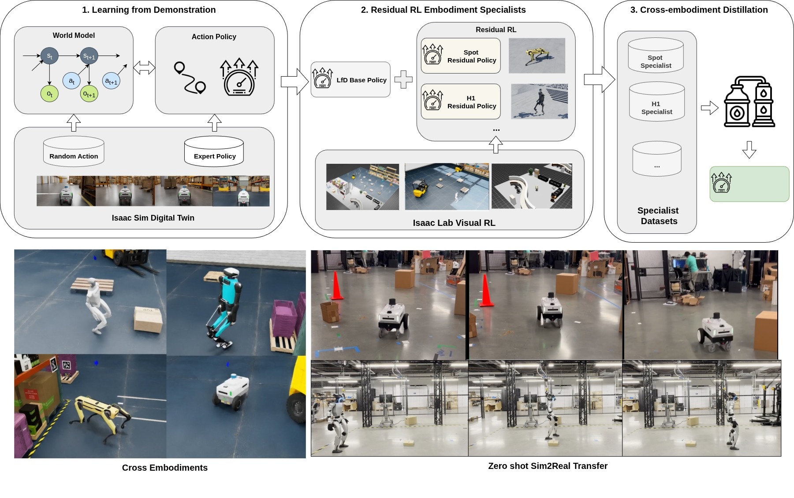

<h1 align="center"> COMPASS: Cross-Embodiment Mobility Policy via Residual RL and Skill Synthesis </h1>

<div align="center">

[](https://isaac-sim.github.io/IsaacLab/v3.0.0-beta1/index.html)
[](https://docs.isaacsim.omniverse.nvidia.com/4.5.0/index.html)
[](https://ubuntu.com/blog/tag/22-04-lts)
[](https://opensource.org/licenses/Apache-2.0)


[[Website]](https://nvlabs.github.io/COMPASS/)
[[Documentation]](https://nvlabs.github.io/COMPASS/docs/)
[[arXiv]](https://arxiv.org/abs/2502.16372)
</div>

## Overview

This repository provides the official PyTorch implementation of [COMPASS](https://nvlabs.github.io/COMPASS/).

<p align="center">
    
</p>

COMPASS is a framework for cross-embodiment mobility that combines:

- Imitation Learning (IL) for strong baseline performance
- Residual Reinforcement Learning (RL) for embodiment-specific adaptation
- Policy distillation to create a unified, generalist policy

## Quick start

```bash
git clone https://github.com/NVlabs/COMPASS.git && cd COMPASS

export HF_TOKEN=hf_xxx                    # https://huggingface.co/settings/tokens
./docker/run.sh assets                    # USDs + X-Mobility ckpt → ./assets/   (~5 min)
./docker/run.sh build                     # build the dev image                  (~10 min)
source ./docker/activate                  # venv-like activation (prompt: (compass-rl))

python run.py -c configs/train_config.gin -o /tmp/out -b ./assets/x_mobility.ckpt --enable_cameras
```

`python` is now a shim that runs inside the container. Edit code with your host
editor — the bind-mount means changes hot-reload. `deactivate` to leave;
`./docker/run.sh down` to stop the container.

## Documentation

Everything else — install details, training / distillation / export workflows,
ROS2 deployment, OSMO cloud submission, GR00T post-training, agentic skills,
auto-OMap generation, and contributing — lives in the **handbook**:

> 📖 **<https://nvlabs.github.io/COMPASS/docs/>**

## License

COMPASS is released under the Apache License 2.0. See [LICENSE](LICENSE) for additional details.

## Core contributors

Wei Liu, Huihua Zhao, Chenran Li, Joydeep Biswas, Soha Pouya, Yan Chang

## Acknowledgments

We would like to acknowledge the following projects where parts of the codes in this repo is derived from:

- [RSL_RL](https://github.com/leggedrobotics/rsl_rl/tree/main)
- [Isaac Lab](https://github.com/isaac-sim/IsaacLab)

## Citation

If you find this work useful in your research, please consider citing:

```bibtex
@article{liu2025compass,
  title={COMPASS: Cross-embodiment Mobility Policy via Residual RL and Skill Synthesis},
  author={Liu, Wei and Zhao, Huihua and Li, Chenran and Biswas, Joydeep and Pouya, Soha and Chang, Yan},
  journal={arXiv preprint arXiv:2502.16372},
  year={2025}
}
```
