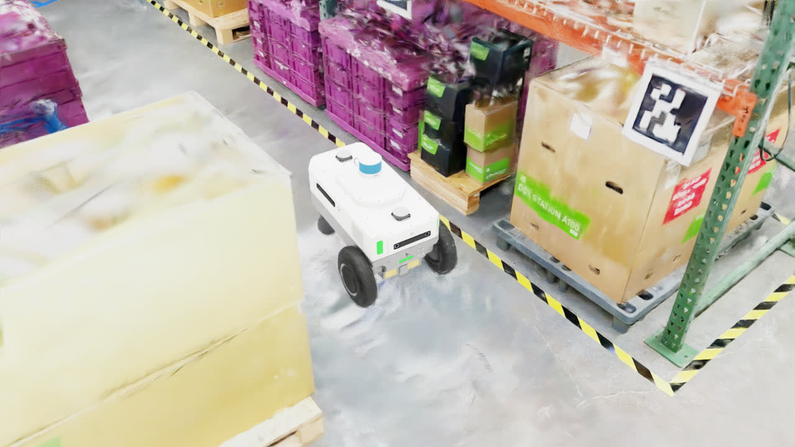

# Training & deploying with NuRec Real2Sim scenes

This guide shows how to train and deploy COMPASS navigation policies on
**NuRec Real2Sim** assets in Isaac Lab. Use Docker for local runs and OSMO for
cloud runs.

```{note}
Validated on **Ubuntu 22.04** / **OVX with RTX**, using the temporary internal
Isaac Lab 3.0 release image until the matching public Isaac Lab image is
available.
```

## Docker workflow (recommended)

### 1. Prepare prerequisites

- Docker with the NVIDIA Container Toolkit.
- An NVIDIA GPU + driver that satisfies the Isaac Sim 6.0.1 requirements.
- A Hugging Face token with access to the COMPASS and NuRec assets.
- The Hugging Face CLI on the host.

Install the Hugging Face CLI before `source ./docker/activate`:

```bash
python3 -m pip install --user -U 'huggingface_hub[cli]'
```

### 2. Check out COMPASS

```bash
git clone https://github.com/NVlabs/COMPASS.git
cd COMPASS
git fetch
git checkout real2sim/isaaclab_3.0
```

### 3. Download assets and checkpoints

The asset helper is host-side. It downloads COMPASS USDs into the `mobility_es`
USD tree, stores the X-Mobility checkpoint at `./assets/x_mobility.ckpt`, and
installs requested NuRec scenes under
`compass/rl_env/exts/mobility_es/mobility_es/usd/`.

```bash
export HF_TOKEN=hf_xxx

./docker/run.sh assets \
    --nurec-scene nova_carter-galileo \
    --nurec-revision refs/pr/34
```

Use one `--nurec-scene <scene>` flag per scene. The helper excludes
`raw_images.zip`, skips existing assets, and is safe to re-run.

```{note}
You must accept the dataset terms on Hugging Face before downloading.
```

### 4. Build and activate the container

The NuRec image currently uses an internal Isaac Lab 3.0 release base image
because the old public `3.0.0-beta1` image is not compatible with this branch.
Replace it with the matching public Isaac Lab image after release.

```bash
export COMPASS_IMAGE_TAG=isaaclab-3.0-ea

./docker/run.sh build
source ./docker/activate
```

After activation, `python`, `python3`, `pip`, `pytest`, and `isaaclab.sh` run
inside the COMPASS container. The repo remains editable on the host through the
bind mount.

### 5. Verify scene placement

Each NuRec scene should live at:

```text
compass/rl_env/exts/mobility_es/mobility_es/usd/<scene>/
```

The asset helper installs scenes there automatically. A scene folder is flat:

```text
nova_carter-galileo/
├── particle_spg-runtime.usdz
├── particle_sh_optimized.usdz
├── volume.usdz
├── occupancy_map.yaml
├── occupancy_map.png
```

Scene names are listed in `compass/utils/nurec_utils.py`.

Registered scenes:

| `--nurec-scene` | Description |
|---|---|
| `nova_carter-galileo` | Galileo lab |
| `nova_carter-cafe` | NVIDIA cafe |
| `hand_hold-endeavor-andoria` | Endeavor meeting room |
| `hand_hold-endeavor-livingroom` | Endeavor living room |
| `hand_hold-endeavor-wormhole` | Endeavor conference room |
| `hand_hold-endeavor-wormhole-table` | Endeavor conference room with table |
| `hand_hold-voyager-babyboom` | Voyager conference room |

```{note}
NuRec maps use a ROS bottom-left origin convention. The registry sets this by
default; using the wrong convention leads to bad robot spawn locations.
```

### 6. Test the setup

```bash
cd compass/rl_env
python scripts/play.py --visualizer kit
cd -
```

### 7. Train

Use `--nurec-usd-file <filename>` to choose a USD from the selected scene
folder. The current workflow supports particle USD assets; volume
assets are present in some scene folders but are not tested.

| Asset | Use | Notes |
|---|---|---|
| `particle_spg-runtime.usdz` | Default particle USD. | Automatically turns on SPG in Isaac Sim and enables the copied PPISP viewport path. |
| `particle_sh_optimized.usdz` | Particle USD without SPG runtime. | SPG runtime stays off automatically; no extra flag is needed. |

#### Default particle SPG-runtime command:

```bash
python run.py \
    -c configs/train_config_real2sim.gin \
    -o <output_dir> \
    -b ./assets/x_mobility.ckpt \
    --embodiment carter \
    --nurec-scene nova_carter-galileo \
    --num_envs 12 \
    --video \
    --video_interval 1 \
    --visualizer kit \
    --precompute_valid_poses
```

Reference output:

| Kit viewport | Robot-camera debug grid |
|---|---|
|  |  |

#### SH-optimized particle command:

```bash
python run.py \
    -c configs/train_config_real2sim.gin \
    -o <output_dir> \
    -b ./assets/x_mobility.ckpt \
    --embodiment carter \
    --nurec-scene nova_carter-galileo \
    --nurec-usd-file particle_sh_optimized.usdz \
    --num_envs 12 \
    --video \
    --video_interval 1 \
    --visualizer kit \
    --precompute_valid_poses
```

Reference output:

| Kit viewport | Robot-camera debug grid |
|---|---|
|  |  |

The Kit viewport is an extreme novel view from above the robot, so render
quality can be lower than the onboard camera. It is only for user visualization
and is not used for training. The robot-camera debug grid is the
policy-observation reference used by training.

Key options:

- `<embodiment_type>`: `h1`, `spot`, `carter`, `g1`, or `digit`.
- `--nurec-scene`: any registered NuRec scene. This is a NuRec-specific alias
  for `--environment`; assets must already be installed.
- `--nurec-usd-file`: NuRec USD filename under the selected scene folder.
  Defaults to `particle_spg-runtime.usdz`; use
  `--nurec-usd-file particle_sh_optimized.usdz` to swap assets.
- `--spg-runtime`: advanced override for custom SPG-runtime USDs. Usually omit
  it; COMPASS automatically enables SPG for `particle_spg-runtime.usdz` in
  registered NuRec scenes and leaves it off for `particle_sh_optimized.usdz`.
- `--num_envs 12`: conservative default; increase only after checking VRAM.
- `--precompute_valid_poses`: recommended for constrained Real2Sim scenes.
- With `--visualizer kit`, the GUI uses the Kit perspective camera; debug
  images and policy observations still use the robot camera sensor. For
  `particle_spg-runtime.usdz`, COMPASS copies the authored NuRec PPISP
  RenderProduct, retargets it to the chase camera, and applies NuRec identity
  exposure. SPG runtime Kit args are enabled automatically for this asset
  before Isaac Sim starts. COMPASS uses the first RenderProduct with a camera
  target in the source NuRec USD.
- Debug dumps include `camera_grid_*.png` for robot-camera RGB/depth and
  `kit_viewport_*.png` plus `kit_viewport_*.png.txt` for the GUI viewport.

Output checkpoints are written as `<output_dir>/model_<iter>.pt`; videos land
in `<output_dir>/videos/`.

```{note}
To run headless, omit `--visualizer kit` or pass `--visualizer None`.
```

```{note}
Approximate per-GPU VRAM for `nova_carter-galileo`, Carter, 320x512 camera:
particle assets use `8.5 GB + 1.0 GB × num_envs`.
Safe particle defaults are about 18 envs on 32 GB and 32 envs on 48 GB.
Reduce `--num_envs` on OOM.
```

### 8. Train on multiple GPUs

```bash
python -m torch.distributed.run --nproc_per_node=<N> \
    run.py --distributed \
    -c configs/train_config_real2sim.gin \
    -o <output_dir> \
    -b ./assets/x_mobility.ckpt \
    --embodiment carter \
    --nurec-scene nova_carter-galileo \
    --num_envs <per-GPU> \
    --precompute_valid_poses \
    --video \
    --video_interval 1
```

`--num_envs` is per GPU. Run headless for multi-GPU by omitting
`--visualizer kit`. Rank 0 owns logging, checkpoints, and video.

### 9. Evaluate

```bash
python run.py \
    -c configs/eval_config_real2sim.gin \
    -o <output_dir> \
    -b ./assets/x_mobility.ckpt \
    -p <path/to/residual_policy_ckpt> \
    --embodiment carter \
    --nurec-scene nova_carter-galileo \
    --num_envs <num_envs> \
    --video \
    --video_interval 1 \
    --visualizer kit
```

`<path/to/residual_policy_ckpt>` is usually `<output_dir>/model_<iter>.pt`.

### 10. Export and deploy

```bash
cd <output_dir>/
python <path/to/COMPASS>/onnx_conversion.py \
    -b <x_mobility_ckpt> \
    -r <residual_policy_ckpt> \
    -e carter \
    -o <output.onnx> \
    -j <output.jit>

python <path/to/COMPASS>/trt_conversion.py \
    -o <model.onnx> \
    -t <output.engine>
```

Deploy through the
[COMPASS ROS2 Deployment Guide](https://github.com/NVlabs/COMPASS/tree/main/ros2_deployment).

## OSMO workflow

Use OSMO for cloud training or eval after the local Docker setup is working.
Run the launcher on the host, not inside the runtime container:

```bash
export WANDB_API_KEY=<your-wandb-key>
export HF_TOKEN=<your-hf-token>
export COMPASS_OSMO_REGISTRY=nvcr.io/<org>/<team>
osmo login
```

NuRec OSMO jobs download COMPASS USDs, the X-Mobility checkpoint, and the
requested NuRec scene inside the workflow. When `--nurec-scene` is set, the
workflow switches to the Real2Sim gin config and passes `--nurec-scene` and
`--nurec-usd-file` to `run.py`.
Use `--nurec-scene` instead of `--environment` so the same scene drives both
the Hugging Face asset download and the NuRec runtime branch.

Training example:

```bash
python osmo/run_osmo.py train \
    --experiment-name nurec \
    --wandb-project compass-nurec-carter-galileo \
    --embodiment carter \
    --nurec-scene nova_carter-galileo \
    --nurec-revision refs/pr/34 \
    --nurec-usd-file particle_spg-runtime.usdz \
    --num-envs 12 \
    --num-gpus 8
```

Evaluation example:

```bash
python osmo/run_osmo.py eval \
    --experiment-name nurec-eval \
    --wandb-project compass-nurec-carter-galileo-eval \
    --checkpoint <residual-wandb-artifact> \
    --embodiment carter \
    --nurec-scene nova_carter-galileo \
    --nurec-revision refs/pr/34 \
    --nurec-usd-file particle_spg-runtime.usdz \
    --num-envs 12
```

OSMO runs are headless, so they do not produce the Kit perspective viewport.
Use W&B videos and robot-camera debug images for run inspection. Add
`--dry-run` to inspect the generated `osmo workflow submit` command, or pass
`--image <pre-built-image>` to skip build and push. Full reference:
[OSMO cloud submission](../osmo.md).

## Troubleshooting

- **Pose sampling fails:** lower collision distances, enable
  `--precompute_valid_poses`, and confirm the occupancy map exists.
- **Robot spawns outside the scene:** check the scene's origin convention.
  NuRec scenes should use `bottom-left`.
- **CUDA OOM:** lower `--num_envs`; NuRec scenes are memory-heavy, and
  `--num_envs` is per GPU when distributed.
