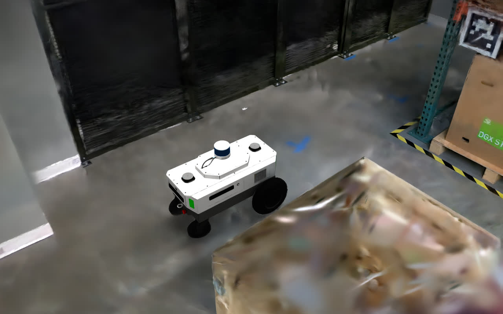

# Training & deploying with NuRec Real2Sim scenes

This guide shows how to train and deploy COMPASS navigation policies on
**NuRec Real2Sim** assets in Isaac Lab. Use Docker for local runs and OSMO for
cloud runs.

```{note}
Validated on **Ubuntu 22.04** / **OVX with RTX**, using the temporary internal
Isaac Lab 3.0 release image until the matching public Isaac Lab image is
available.
```

## Docker workflow (recommended)

### 1. Prepare prerequisites

- Docker with the NVIDIA Container Toolkit.
- An NVIDIA GPU + driver that satisfies the Isaac Sim 6.1 requirements.
- A Hugging Face token with access to the COMPASS and NuRec assets.
- The Hugging Face CLI on the host.

Install the Hugging Face CLI before `source ./docker/activate`:

```bash
python3 -m pip install --user -U 'huggingface_hub[cli]'
```

### 2. Check out COMPASS

```bash
git clone https://github.com/NVlabs/COMPASS.git
cd COMPASS
git fetch
git checkout real2sim/isaaclab_3.0
```

### 3. Download assets and checkpoints

The asset helper is host-side. It downloads COMPASS USDs into the `mobility_es`
USD tree, stores the X-Mobility checkpoint at `./assets/x_mobility.ckpt`, and
installs requested NuRec scenes under
`compass/rl_env/exts/mobility_es/mobility_es/usd/`.

```bash
export HF_TOKEN=hf_xxx

./docker/run.sh assets \
    --nurec-scene nova_carter-galileo
```

Use one `--nurec-scene <scene>` flag per scene.

```{note}
You must accept the dataset terms on Hugging Face before downloading.
```

### 4. Build and activate the container

```bash
export COMPASS_IMAGE_TAG=isaaclab-3.0-ea

./docker/run.sh build
source ./docker/activate
```

After activation, `python`, `python3`, `pip`, `pytest`, and `isaaclab.sh` run
inside the COMPASS container. The repo remains editable on the host through the
bind mount.

### 5. Verify scene placement

Each NuRec scene should live at:

```text
compass/rl_env/exts/mobility_es/mobility_es/usd/<scene>/
```

The asset helper installs scenes there automatically. Relevant scene files
include:

```text
nova_carter-galileo/
├── particle_spg-runtime.usdz  # Particle-field USD with SPG
├── occupancy_map.yaml
├── occupancy_map.png
```

Pass the scene folder name to `--nurec-scene`; COMPASS builds the NuRec scene
config from that folder at runtime.

Registered scenes:

| `--nurec-scene` | Description |
|---|---|
| `nova_carter-galileo` | Galileo lab — aisles, shelves, boxes |
| `nova_carter-cafe` | Cafe area — open area, natural lighting |
| `nova_carter-wormhole` | Conference room |
| `hand_hold-endeavor-andoria` | Meeting room, Endeavor building |
| `hand_hold-endeavor-livingroom` | Living room, Endeavor building |
| `hand_hold-endeavor-wormhole` | Conference room, Endeavor building |
| `hand_hold-endeavor-wormhole-table` | Conference room (with table), Endeavor |
| `hand_hold-voyager-babyboom` | Conference room, Voyager building |
| `xgrid-wormhole` | Wormhole conference room with sim objects |

```{note}
NuRec maps use a ROS bottom-left origin convention. The registry sets this by
default; using the wrong convention leads to bad robot spawn locations.
```

### 6. Test the setup

```bash
cd compass/rl_env
python scripts/play.py --visualizer kit
cd -
```

### 7. Train

#### Default particle SPG-runtime command:

```bash
python run.py \
    -c configs/train_config_real2sim.gin \
    -o <output_dir> \
    -b ./assets/x_mobility.ckpt \
    --embodiment carter \
    --nurec-scene nova_carter-galileo \
    --num_envs 32 \
    --video \
    --video_interval 1 \
    --precompute_valid_poses
```

This command uses the default `particle_spg-runtime.usdz`. Use
`--nurec-usd-file <filename>` to choose another USD from the selected scene
folder.

| Kit viewport | Robot camera |
|---|---|
|  |  |

The Kit viewport is an extreme novel view from above the robot, so render
quality can be lower than the onboard camera. It is only for user visualization
and is not used for training. The robot-camera debug grid is the
policy-observation reference used by training.

Key options:

- `<embodiment_type>`: `h1`, `spot`, `carter`, `g1`, or `digit`.
- `--nurec-scene`: any installed NuRec scene folder. This is a NuRec-specific
  alias for `--environment`; assets must already be installed.
- `--nurec-usd-file`: NuRec USD filename under the selected scene folder.
  Defaults to `particle_spg-runtime.usdz`; override it only when testing a
  custom NuRec USD. For `xgrid-wormhole`, use
  `stage_particle_with_sim_objects.usd`.
- `--nurec-omap-file`: optional occupancy-map YAML filename under the selected
  scene folder. Omit it to use the scene default, usually
  `occupancy_map.yaml`. For `xgrid-wormhole`, use
  `occupancy_map_with_sim_objects.yaml`.
- `--spg-runtime`: advanced override for custom SPG-runtime USDs. Usually omit
  it; COMPASS automatically enables SPG for `particle_spg-runtime.usdz` when
  `--nurec-scene` is set.
- `--num_envs 32`: set according to your VRAM.
- `--precompute_valid_poses`: recommended for constrained Real2Sim scenes.
- Debug dumps include `camera_grid_*.png` for robot-camera RGB/depth. With
  `--visualizer kit`, they also include `kit_viewport_*.png` plus
  `kit_viewport_*.png.txt` for the GUI viewport.
- Append `--visualizer kit` to show the third-person viewport. The viewport can
  be an extremely novel view and is only used for visualization.

Output checkpoints are written as `<output_dir>/model_<iter>.pt`; check
`<output_dir>/videos/` for rollout videos.

```{note}
Approximate per-GPU VRAM for `nova_carter-galileo` with Carter and a 320x512
camera:

- Particle assets: `8.5 GB + 1.0 GB * num_envs`
- Safe defaults: about 18 envs on 32 GB, or 32 envs on 48 GB
- OOM recovery: reduce `--num_envs`
```

### 8. Train on multiple GPUs

```bash
python -m torch.distributed.run --nproc_per_node=<N> \
    run.py --distributed \
    -c configs/train_config_real2sim.gin \
    -o <output_dir> \
    -b ./assets/x_mobility.ckpt \
    --embodiment carter \
    --nurec-scene nova_carter-galileo \
    --num_envs <per-GPU> \
    --precompute_valid_poses \
    --video \
    --video_interval 1
```

`--num_envs` is per GPU. Run headless for multi-GPU by omitting
`--visualizer kit`. Rank 0 owns logging, checkpoints, and video.

### 9. Evaluate

```bash
python run.py \
    -c configs/eval_config_real2sim.gin \
    -o <output_dir> \
    -b ./assets/x_mobility.ckpt \
    -p <path/to/residual_policy_ckpt> \
    --embodiment carter \
    --nurec-scene nova_carter-galileo \
    --num_envs <num_envs> \
    --video \
    --video_interval 1 \
    --visualizer kit
```

`<path/to/residual_policy_ckpt>` is usually `<output_dir>/model_<iter>.pt`.

The key options above apply to evaluation mode as well.

Omit `--visualizer kit` for faster evaluation without GUI. The viewport can be
an extremely novel view and can have occlusion.

### 10. Export and deploy

```bash
cd <output_dir>/
python <path/to/COMPASS>/onnx_conversion.py \
    -b <x_mobility_ckpt> \
    -r <residual_policy_ckpt> \
    -e carter \
    -o <output.onnx> \
    -j <output.jit>

python <path/to/COMPASS>/trt_conversion.py \
    -o <model.onnx> \
    -t <output.engine>
```

Deploy through the
[COMPASS ROS2 Deployment Guide](https://github.com/NVlabs/COMPASS/tree/main/ros2_deployment).

## OSMO workflow

Use OSMO for cloud training or eval after the local Docker setup is working.
Run the launcher on the host, not inside the runtime container:

```bash
export WANDB_API_KEY=<your-wandb-key>
export HF_TOKEN=<your-hf-token>
export COMPASS_OSMO_REGISTRY=nvcr.io/<org>/<team>
osmo login
```

NuRec OSMO jobs download COMPASS USDs, the X-Mobility checkpoint, and the
requested NuRec scene inside the workflow. When `--nurec-scene` is set, the
workflow switches to the Real2Sim gin config and passes `--nurec-scene` and
`--nurec-usd-file` to `run.py`. Use `--nurec-omap-file <filename>` when the
workflow should use a non-default occupancy map. Omit `--nurec-revision` to use
the Hugging Face dataset default branch; pass it only to pin a specific
revision.

Training example:

```bash
python osmo/run_osmo.py train \
    --experiment-name carter-galileo-osmo \
    --wandb-project compass-nurec \
    --embodiment carter \
    --nurec-scene nova_carter-galileo \
    --nurec-usd-file particle_spg-runtime.usdz \
    --num-envs 32 \
    --num-gpus 8
```

Evaluation example:

```bash
python osmo/run_osmo.py eval \
    --experiment-name carter-galileo-osmo-eval \
    --wandb-project compass-nurec \
    --checkpoint <residual-wandb-artifact> \
    --embodiment carter \
    --nurec-scene nova_carter-galileo \
    --nurec-usd-file particle_spg-runtime.usdz \
    --num-envs 32
```

OSMO runs are headless, so they do not produce the Kit perspective viewport.
Use W&B videos and robot-camera debug images for run inspection. Add
`--dry-run` to inspect the generated `osmo workflow submit` command, or pass
`--image <pre-built-image>` to skip build and push. Full reference:
[OSMO cloud submission](../osmo.md).

## Troubleshooting

- **Pose sampling fails:** lower collision distances, enable
  `--precompute_valid_poses`, and confirm the occupancy map exists.
- **Robot spawns outside the scene:** check the scene's origin convention.
  NuRec scenes should use `bottom-left`.
- **CUDA OOM:** lower `--num_envs`; NuRec scenes are memory-heavy, and
  `--num_envs` is per GPU when distributed.
